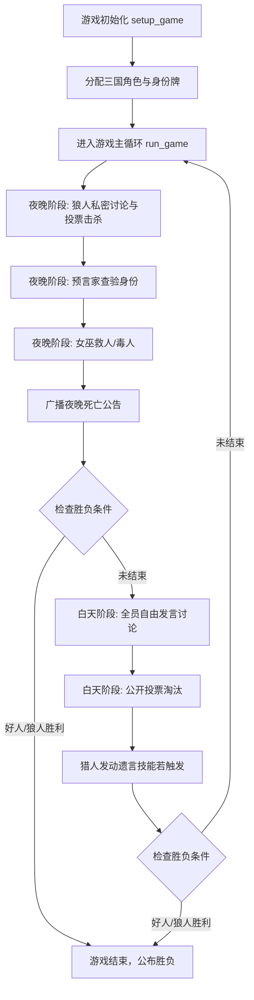

# 三国狼人杀 (Three Kingdoms Werewolf) - 基于 AgentScope 的多智能体系统

本项目是一个基于 **AgentScope** 框架构建的中文多智能体（Multi-Agent）博弈演练系统。系统将经典《三国演义》角色（如诸葛亮、刘备、曹操、周瑜、关羽、赵云、司马懿、孙权等）与传统狼人杀游戏规则融为一体，通过大语言模型（LLM）驱动智能体进行自我身份认知、暗中协同、公开发言逻辑推演与投票淘汰。

---

## 目录
- [项目特色](#项目特色)
- [目录结构](#目录结构)
- [环境变量配置](#环境变量配置)
- [快速开始](#快速开始)
- [游戏流程说明](#游戏流程说明)
- [系统架构设计](#系统架构设计)
- [扩展思路：增加人类玩家交互](#扩展思路增加人类玩家交互)

---

## 项目特色

1. **沉浸式角色设定**：结合三国人物性格与能力（如诸葛亮的足智多谋、曹操的多疑、周瑜的傲骨、关羽的忠义），在狼人杀语境下展现独特的古风口吻与逻辑推演。
2. **结构化输出约束**：利用 Pydantic 校验各环节输入输出（如狼人讨论、投票决策、预言家查验、女巫用药），保障多轮对话调用的稳定性与规范性。
3. **多智能体广播与通信**：使用 AgentScope 的 `MsgHub`、`sequential_pipeline` 及 `fanout_pipeline` 灵活实现私密讨论与公开讨论。
4. **模型容错与强健机制**：内置针对 DashScope 多智能体消息格式化与 thinking 块的兼容防护补丁，保障长时间多轮推理不崩溃。

---

## 目录结构

```text
AgentScopeDemo/
├── main_cn.py              # 游戏主入口（控制器、阶段管理与游戏循环）
├── game_roles.py           # 游戏角色与身份规则定义
├── promot_cn.py            # 三国角色系统提示词 (Prompt) 模板
├── structured_output_cn.py # 各阶段 Pydantic 结构化输出模型
├── utils_cn.py             # 主持人类 (GameModerator)、胜负判断与辅助工具函数
├── requirements.txt        # 项目依赖清单
├── .env.example            # 环境变量示例文件
└── README.md               # 项目说明文档
```

---

## 环境变量配置

在 `AgentScopeDemo` 目录下创建 `.env` 文件，填入阿里云 DashScope（通义千问）的 API Key 与模型配置：

```env
# 阿里云百炼/DashScope API Key
LLM_API_KEY="your_dashscope_api_key_here"

# 调用的大语言模型 ID (推荐使用 qwen3.7-max 或 qwen-max)
LLM_MODEL_ID="qwen3.7-max"

# 接口兼容地址
LLM_BASE_URL="https://dashscope.aliyuncs.com/compatible-mode/v1"
LLM_TIMEOUT=60
```

---

## 快速开始

### 1. 安装依赖

确保已激活 Python 虚拟环境，在项目根目录运行：

```bash
pip install -r requirements.txt
```

### 2. 运行游戏

执行主程序启动自动对弈：

```bash
python main_cn.py
```

---

## 游戏流程说明



1. **游戏设置 (`setup_game`)**：随机抽取角色配置（狼人、预言家、女巫、猎人、村民），赋予各 Agent 三国背景 Prompt。
2. **夜晚阶段 (`werewolf_phase` / `seer_phase` / `witch_phase`)**：
   - **狼人**：通过私密通信通道 `MsgHub` 协同讨论目标并投票。
   - **预言家**：查验任意存活玩家阵营。
   - **女巫**：收到夜间死亡信息后决定是否使用解药或毒药。
3. **白天阶段 (`day_phase`)**：
   - 全员依次自由发言讨论，进行身份博弈与带节奏。
   - 票决淘汰怀疑对象，淘汰玩家触发遗言/技能（如猎人）。
4. **胜利判定 (`check_winning_cn`)**：
   - 所有狼人被淘汰 -> **好人阵营胜利**。
   - 狼人数量达到或超过好人数量 -> **狼人阵营胜利**。

---

## 系统架构设计

系统设计遵循分层与解耦原则，分为 **游戏控制层**、**智能体交互层** 和 **角色建模层**：

```text
┌──────────────────────────────────────────────────────────┐
│                   游戏控制层 (Control Layer)              │
│  ThreeKingdomsWerewolfGame / GameModerator /胜负判定      │
└─────────────────────────────┬────────────────────────────┘
                              │ 驱动流程
┌─────────────────────────────▼────────────────────────────┐
│                智能体交互层 (Interaction Layer)            │
│  MsgHub (私密/公开频道) / Sequential & Fanout Pipelines  │
└─────────────────────────────┬────────────────────────────┘
                              │ 传输与结构化约束
┌─────────────────────────────▼────────────────────────────┐
│                 角色建模层 (Agent Layer)                  │
│  ReActAgent / DashScopeChatModel / Pydantic Output Models│
└──────────────────────────────────────────────────────────┘
```

### 1. 游戏控制层 (Control Layer)
- **`ThreeKingdomsWerewolfGame`**：主调度器，控制黑夜与白天的阶段转换，维护存活玩家状态列表与胜负判定。
- **`GameModerator`**：继承自 `AgentBase`，担任游戏主持人角色，负责全场游戏公告宣布与流程引导。

### 2. 智能体交互层 (Interaction Layer)
- **`MsgHub`**：管理智能体之间的消息隔离与广播（例如狼人夜间讨论只在狼人组内广播，白天自由讨论在全员内广播）。
- **`sequential_pipeline` / `fanout_pipeline`**：控制顺序发言流水线与并发投票收集。

### 3. 角色建模层 (Agent Layer)
- **`ReActAgent`**：基于代理模式的智能体基类，管理单个三国角色的 Memory 与推理行为。
- **`ChinesePrompts`**：注入角色专属口吻与身份设定。
- **`structured_output_cn`**：使用 Pydantic 模型确保智能体输出特定 JSON 结构的决策（如怀疑度、击杀目标、投票理由）。

---

## 扩展思路：增加人类玩家交互

当前系统为 AI vs AI 全自动模拟演练。若要支持人类玩家（真人）直接在命令行参与游戏，可按以下思路实现：

1. **替换 Agent 类型**：
   AgentScope 提供了 `UserAgent`（人类交互智能体）。在初始化玩家时，根据用户选择的角色名，将指定的 `ReActAgent` 替换为 `UserAgent`：
   ```python
   from agentscope.agent import UserAgent

   if character == human_character_name:
       agent = UserAgent(name=human_player_name)
   else:
       agent = ReActAgent(...)
   ```
2. **终端交互适配**：
   - 当轮到人类玩家发言或投票时，`UserAgent` 会在控制台暂停，并等待键盘输入。
   - 对于结构化选择（如预言家查验、投票），可在控制台提供编号列表供人类选择，自动拼装为合规格式传入游戏流程。
3. **身份保密机制**：
   在控制台输出时，仅在夜晚阶段展示人类玩家角色所拥有的私密信息（如狼人视角能看到队友发言，非狼人视角隐藏黑夜信息），确保游戏公平性与沉浸感。
