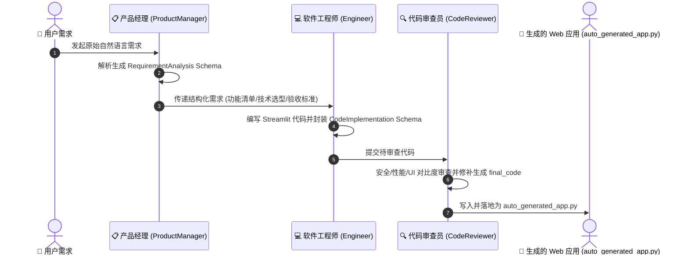

# AutoGen 多智能体软件开发团队案例 (AutoGenDemo)

本项目是一个基于 **Microsoft AutoGen v0.4** 框架构建的“自动化软件开发团队”多智能体协同系统。系统通过 Pydantic 强类型结构化输出模型约束智能体间的沟通交流，实现了从**需求分析（产品经理）** 到 **代码构建（软件工程师）**，再到 **代码审查与重构（代码审查员）** 的自动化软件开发流水线，并最终直接导出生成可运行的 Streamlit Web 应用。

---

## 目录
- [文件说明](#文件说明)
- [案例特点](#案例特点)
- [环境准备](#环境准备)
- [运行案例（预期输出流程）](#运行案例预期输出流程)
- [智能体角色说明](#智能体角色说明)
- [案例演示与生成的应用](#案例演示与生成的应用)

---

## 文件说明

| 文件名 | 说明 |
| :--- | :--- |
| `auto_software_team_v4.py` | **推荐主运行脚本**。基于 AutoGen v0.4 异步架构 + Pydantic 强类型 JSON Schema 构建的多智能体团队流水线。 |
| `auto_software_team.py` | 经典版本的多智能体开发团队流水线实现。 |
| `auto_generated_app.py` | **多智能体团队协作自动生成的最终产物**（Streamlit 比特币实时价格看板 Web 应用）。 |
| `.env.example` | 环境变量配置文件模板。 |
| `.env` | 本地环境变量配置文件（需自建，填写 API Key 与 Endpoint）。 |
| `requirements.txt` | 项目 Python 依赖包清单（包含 `autogen-agentchat`, `autogen-ext`, `pydantic`, `streamlit` 等）。 |

---

## 案例特点

1. **AutoGen v0.4 异步新架构**：基于 AutoGen 最新 0.4.x 的 `autogen_agentchat` 异步事件响应机制与 `OpenAIChatCompletionClient`。
2. **Pydantic 强类型结构化约束**：使用 Pydantic Model 作为智能体交互与交付的标准 Data Schema，消除传统 LLM 自由文本输出中的格式不确定性与解析报错。
3. **闭环自动软件交付**：多智能体协作不只停留在对话阶段，审查员会将审核并重构后的代码直接导出落地为 `auto_generated_app.py` 文件。
4. **多 API 容错与样式防坑设计**：针对 Web 数据接口常见的限流/451 错误以及 Streamlit 暗黑模式文字高对比度适配进行了防御性编码。

---

## 环境准备

### 1. 安装依赖

确保已激活 Python 虚拟环境，在 `AutoGenDemo` 目录下运行：

```bash
pip install -r requirements.txt
```

### 2. 配置环境变量

在 `AutoGenDemo` 目录下创建 `.env` 文件，配置 LLM 服务的 API Key（支持 OpenAI / DeepSeek / 通义千问等兼容 API）：

```env
# 大语言模型 API Key
LLM_API_KEY="your_api_key_here"

# 模型 ID（推荐使用 gpt-4o、deepseek-chat 或 qwen-max 等强逻辑模型）
LLM_MODEL_ID="gpt-4o"

# API Endpoint 地址
LLM_BASE_URL="https://api.openai.com/v1"
```

---

## 运行案例（预期输出流程）

### 运行流水线

在终端中执行以下命令启动多智能体协作开发流程：

```bash
python auto_software_team_v4.py
```

### 预期控制台输出流程

程序启动后，将按三阶段流水线依次执行：

```text
🚀 启动 AutoGen v0.4 结构化多智能体流水线...
============================================================

📋 [任务发起]：你需要开发一个比特币价格实时显示 Web 应用，要求：
1. 界面简洁美观，支持显示比特币当前价格 (USD)、24小时涨跌额与涨跌幅。
2. 包含刷新功能按钮。
3. 必须具备良好的错误处理与多数据源容错。
4. 适配暗黑/深色模式下的高对比度卡片样式。

👤 [1/3] ProductManager 正在分析需求...
✅ 需求分析完成：标题为 《比特币实时价格与市场看板》

💻 [2/3] Engineer 正在根据分析结果进行代码构建...
✅ 代码开发完成，已包含依赖包: ['streamlit', 'requests']

🔍 [3/3] CodeReviewer 正在评审代码与进行最终重构...

============================================================
🎉 团队协作全流程完成！
📊 代码质量得分: 95 / 100
✅ 审查结论: 审核通过
💬 审查意见:
  - 已增加 CoinGecko / Coinbase 多数据源容错
  - 已优化暗黑模式卡片背景与对比度

💾 已直接通过 Pydantic 对象精准导出最终文件：
   --> auto_generated_app.py
🚀 可以使用以下命令直接运行生成的应用：
   streamlit run auto_generated_app.py
```

---

## 智能体角色说明



| 角色名称 | 类类型 | 核心职责与 Schema |
| :--- | :--- | :--- |
| **ProductManager** (产品经理) | `AssistantAgent` | 负责将用户的原始需求拆解为结构化的功能点、技术栈建议和验收标准（对应 `RequirementAnalysis` 数据模型）。 |
| **Engineer** (软件工程师) | `AssistantAgent` | 负责接收产品经理的需求说明，编写具抗风险能力的 Streamlit Python 应用代码（对应 `CodeImplementation` 数据模型）。 |
| **CodeReviewer** (代码审查员) | `AssistantAgent` | 负责对工程师的代码进行安全、性能死角及 UI 样式的深度审查打分，并输出修正后的最终可运行代码 `final_code`（对应 `CodeReviewReport` 数据模型）。 |

---

## 案例演示（应用功能、技术栈、运行生成的应用）

### 1. 自动生成的应用功能
智能体团队最终生成的 `auto_generated_app.py` 具备以下功能：
* **实时比特币行情卡片**：展示 BTC/USD 实时价格、24 小时涨跌额、涨跌幅百分比。
* **多数据源自动降级机制**：优先调用 Binance API，若触发地区限制或网络异常则自动无缝降级切换至 CoinGecko / Coinbase API。
* **高对比度暗黑 UI 适配**：采用暗色渐变卡片与语义化颜色（绿色上涨、红色下跌），解决默认主题下深色背景文本看不清的问题。
* **一键刷新与自动时间戳**：提供刷新按钮及数据最后更新时间提示。

### 2. 生成应用的所用技术栈
* **UI 框架**：[Streamlit](https://streamlit.io/)
* **HTTP 请求与容错**：[Requests](https://requests.readthedocs.io/)
* **数据校验与反序列化**：[Pydantic v2](https://docs.pydantic.dev/)

### 3. 运行生成的应用

在 `AutoGenDemo` 目录下运行以下命令，即可在浏览器中体验智能体团队自动构建的 Web 应用：

```bash
streamlit run auto_generated_app.py
```

运行后浏览器会自动打开 `http://localhost:8501` 展示比特币实时看板。
