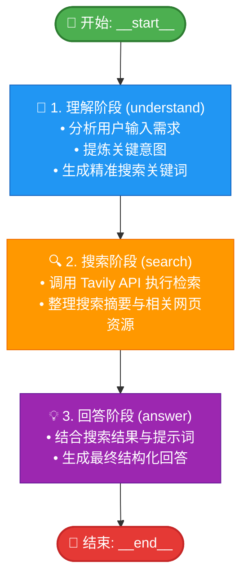

```mermaid
graph TD
    START([🚀 开始: __start__]) --> understand["🧠 1. 理解阶段 (understand)<br/>• 分析用户输入需求<br/>• 提炼关键意图<br/>• 生成精准搜索关键词"]
    understand --> search["🔍 2. 搜索阶段 (search)<br/>• 调用 Tavily API 执行检索<br/>• 整理搜索摘要与相关网页资源"]
    search --> answer["💡 3. 回答阶段 (answer)<br/>• 结合搜索结果与提示词<br/>• 生成最终结构化回答"]
    answer --> END([🏁 结束: __end__])
    style START fill:#4CAF50,stroke:#2E7D32,color:#fff,stroke-width:2px
    style END fill:#E53935,stroke:#C62828,color:#fff,stroke-width:2px
    style understand fill:#2196F3,stroke:#1565C0,color:#fff,stroke-width:1px
    style search fill:#FF9800,stroke:#EF6C00,color:#fff,stroke-width:1px
    style answer fill:#9C27B0,stroke:#6A1B9A,color:#fff,stroke-width:1px
```
